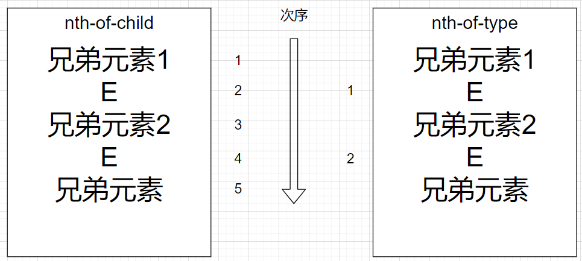
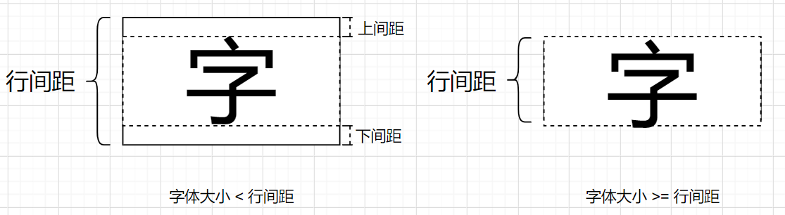
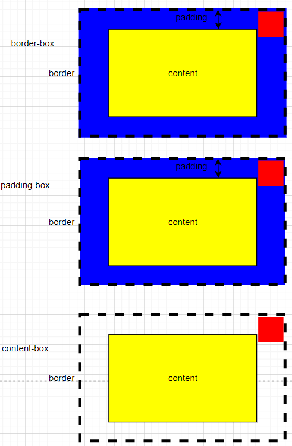
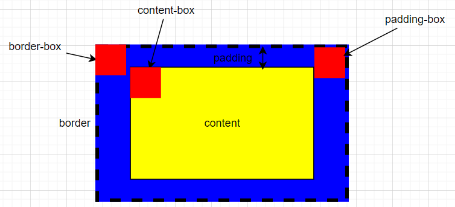

# CSS基础

Cascading Style Sheets，层叠样式表

## 自定义标识符

用户自定义字符串标识符区分大小写，值不能有任何歧义，CSS语法中用`<custom-ident>`表示，由以下字符组成：

- 字母（`A-Z`，`a-z`）
- 十进制数（`0-9`）
- 连字符（`-`）
- 下划线（`_`）
- 转义字符（`\`）
- `Unicode`编码（格式：转义字符（`\`）后跟1到6位十六进制数）

特别的，`<custom-ident>`

- 不能用单引号或双引号包起来；
- 第一个非横线字符必须为字母，数字不能在字母前
- 连字符后不能跟数字或连字符
- 为避免歧义，禁止使用CSS中的特殊值

## 样式引入方式

### 嵌入式

内部样式表，内嵌样式表

在HTML页面内部写样式，写在以下标签内部

```html
<style></style>
<!--
	该标签可以写在HTML页面的任何位置，但一般写在头部（即<head></head>内部）
-->
```

### 行内式

行内样式表，内联样式表

在元素标签内部的`style`属性设置样式

```html
<!-- 例如 -->
<div style="width: 100px; height: 100px; backgroundColor: red">
    一个100px X 100px的红色正方形
</div>
```

### 外链式

外部样式表，链接式

样式单独写到CSS文件中，在引入到HTML文件中

```html
<link rel="stylesheet" href="the url of the css file"/>
```

## CSS选择器

### 基础选择器

#### 标签（元素）选择器（0001）

把某一类标签全部选出来

```css
标签名 {
    attribute: value;
    	....
    attribute: value;
}
```

#### 类选择器（0010）

单独选一个或几个标签

```css
.className {
    attribute: value;
    	....
    attribute: value;
}
```

使用该选择器需要给标签的类赋值：

```html
<标签名 class="className1 className2...">
```

#### id选择器（0100）

每个id选择器只能被调用一次，和js配合使用

```css
#id名称 {
    attribute: value;
    	....
    attribute: value;
}
```

#### 通配符选择器（0000）

选取页面所有元素，自动调用

```css
* {
    attribute: value;
    	....
    attribute: value;
}
```

### 伪类选择器（0010）

CSS伪类是添加到选择器的关键字，**指定要选择的元素的特殊状态**

可以直接使用，也可以指定元素后使用，一般都是指定元素后使用，否则几乎所有的元素都会被设置上相应的样式，造成混乱

```css
E:pseudo 或 :pseudo
```

以下列出常用伪类

#### 链接伪类选择器(`<a></a>`)

```css
a:link /*未访问的链接*/
a:visited /*访问过的链接*/ 
a:hover /*鼠标悬停的链接*/
a:active /*鼠标按下未松开的链接*/
/*以上的a可以替换为 .className，但对应的类必须用于<a></a>标签中*/
/*使用以上四个选择器时，顺序不可打乱，否则无法生效*/
```

#### focus 伪类选择器

```css
input:focus
/*焦点就是光标，一般<input/>元素才能获取*/
```

以上的各种伪类和元素的组合是非常多样的，**有且不限于以上提及的组合**（可以改变元素），根据实际情况判断使用。一般来说在实际应用过程中，会尽量避免把复合选择器的组合弄得复杂，更多的是通过类选择器来给相同标签赋予不同样式

#### 结构伪类选择器(CSS3)

```css
/*兄弟元素之间排序，当选择器的次序对得上且元素为E则样式生效，否则直接忽略*/
E:first-child	/*子元素为第一个元素且为E*/ 
E:last-child	/*子元素为最后一个元素且为E*/
E:nth-child(an+b)	/*子元素为第<n>个元素且为E，其中<n>为数字，关键字（even/odd）或公式*/
E:nth-last-child(an+b)	/*子元素中倒数第<n>个元素且为E，详细语法和 E:nth-child() 类似*/
/*
注意：an+b 中，an 必须写在 b 前面，不能写成 b+an
并且当 + 或 - 作为单目运算符时，不能和运算对象间有空格，而作为双目运算符时可以有空格隔开
注：以上的 n 从 0 开始，而元素的次序从 1 开始

上述nth-child(an+b)中的an+b具体可以使用如下：
1、数字
	E:nth-child(2)
2、关键字
	E:nth-child(even)	次序为偶数的特定子元素
	E:nth-child(odd)	次序为奇数的特定子元素
3、公式
	E:nth-child(2n)
	E:nth-child(2n+1)
	E:nth-child(-n+3)	选取前三个 
nth-last-child()和这类似，但是为从后往前的顺序，即其次序为1的元素为其最后一个元素
*/

/*兄弟元素之间为元素E的进行排序，次序对上的样式生效*/
E:first-of-type	/*子元素中第一个E元素*/
E:last-of-type	/*子元素中最后一个E元素*/
E:nth-of-type(an+b)	/*子元素中第<n>个E元素，详细语法和 E:nth-child() 类似*/
E:nth-last-of-type(an+b)	/*子元素中倒数第<n>个E元素，详细语法和 E:nth-child() 类似*/
```



### 伪元素选择器(CSS3)（0001）

伪元素是一个附加至选择器末的关键词，允许你**对被选择元素的特定部分修改样式**

**一个选择器中只能使用一个伪元素**
伪元素必须紧跟在语句中的简单选择器/基础选择器之后

*按照规范应当在伪元素前添加`::`，以便和伪类前添加的`:`作区分。但是，由于旧版本的 W3C 规范并未对此进行特别区分，因此目前绝大多数的浏览器都同时支持使用这两种方式来表示伪元素*

以下为两个常用伪元素：

- `::before`创建一个伪元素，其将成为匹配选中的元素的第一个子元素
- `::after`用来创建一个伪元素，作为已选中元素的最后一个子元素

`::before` 和`::after` 生成的伪元素 [包含在元素格式框内](https://www.w3.org/TR/CSS2/generate.html#before-after-content)， 因此不能应用在*[替换元素上](https://developer.mozilla.org/en-US/docs/Web/CSS/Replaced_element)*

常通过 [`content`](https://developer.mozilla.org/zh-CN/docs/Web/CSS/content) 属性来为一个元素添加修饰性的内容。**此元素默认为行内元素**

### 伪元素和伪类

与伪元素比较，`pseudo-classes`能够**根据状态**改变元素样式
与伪类相反，`pseudo-elements`可被用于为一个**元素的特定部分**应用样式

伪类连同伪元素一起，它们允许你不仅仅是根据文档 DOM 树中的内容对元素应用样式，而且还允许你根据诸如像导航历史这样的**外部因素**来应用样式（例如 `:visited`），同样的，可以根据内容的状态（例如在一些表单元素上的 `:checked`），或者鼠标的位置（例如 `:hover` 让你知道是否鼠标在一个元素上悬浮）来应用样式

### 属性选择器(CSS3)（0010）

可以直接使用，也可以指定元素后使用

```css
elem[attr]或[attr]
```

#### 存否和值选择器

```css
[attr]	匹配带有一个名为attr的属性的元素——方括号里的值
[attr=value]	匹配带有一个名为attr的属性的元素，其值正为value——引号中的字符串
[attr~=value]	匹配带有一个名为attr的属性的元素，其值有一个或者更多，至少有一个和value匹配（值是用空格隔开的）
[attr|=value]	匹配带有一个名为attr的属性的元素，其值可正为value，或者开始为value，后面紧随着一个连字符
```

#### 子字符串匹配选择器

```css
[attr^=value]	匹配带有一个名为attr的属性的元素，其值开头为value子字符串
[attr$=value]	匹配带有一个名为attr的属性的元素，其值结尾为value子字符串
[attr*=value]	匹配带有一个名为attr的属性的元素，其值的字符串中的任何地方，至少出现了一次value子字符串
```

#### 优先级

```css
/*该选择器可以指定元素，例如*/
div[class=box]
/*这时该属性选择器只对div元素中满足选择条件的元素有效*/
/*如果不指定元素，直接 [class=box]，则对所有元素中满足条件的元素有效*/
/*该选择器的优先级为 0010，当指定元素后，相应的优先级应该叠加为 0001 + 0010 = 0011*/
```

注：

```css
.className {
   	......
}
// 等同于
[class=className] {
    ......
}
```

### 复合选择器

#### 后代选择器

```css
元素1 元素2 元素3... {
    attribute: value;
    	....
    attribute: value;
}
/*这里的元素可以是任意基础选择器（标签、类、id，通配符*），相当于可以将基础选择器中的四种选择器任意组合*/
/*元素也可以是子选择器*/
```

#### 子选择器

```css
元素1>元素2>元素3... {
    attribute: value;
    	....
    attribute: value;
}
/*可以将基础选择器中的四种选择器任意组合*/
/*注意，这里与后代选择器的最根本区别是它只选择 直接子代元素 符合要求的，而后代选择器只要为其后代元素即可*/
```

#### 并集选择器

```css
元素1， 元素2， 元素3, ... {
    attribute: value;
    	....
    attribute: value;
}
/*其元素可以为基础选择器，也可为复合选择器*/
/*该选择器目的是为了同时为多个选择器设置相同样式*/
```

### 选择器优先级

见CSS三大特性的[优先级](#优先级)

## CSS字体属性

### 字体系列

```css
font-family: "Microsoft Yahei";
/*字体系列可以用中文也可以用英文，但英文兼容性比较好*/
/*可以同时有多个值，用英文逗号分隔。多个值可以起到保证网页内容能正常显示的作用——首先生效的值会使其他值失效*/
/*多个单词组成的字体名称尽量用引号包含*/
```

### 字体大小

```css
font-size: 12px;
/*常用的单位是“px”*/
```

### 字体粗细

```css
font-weight: 400;
/*可取的关键字为：normal(400), bold(700), bolder, lighter*/
/*可取数字值为：100, 200, 300, 400, 500, 600, 700, 800, 900。注意：不需要单位*/
/*建议使用数字值*/
```

### 字体风格

```css
font-style: normal|italic
```

### 复合属性

```css
font: <font-style> <font-weight> font-size/<line-height> font-family
/*务必按照该顺序赋值*/
/*可以省略前两个属性值，但务必保留后两（三）个*/
/*font-size/<line-height>可以省略行高，显示书写行高时，行高可以不写单位，有利于元素根据文字大小调整行高（12px/1.5）*/
```

## CSS文本属性

### 文本颜色

```css
color: #ffffff;
/*预定义颜色值，如 red，cyan等*/
/*十六进制，如#ff00ff*/
/*RGB，如rgb(255, 0, 0)，rgb(100%， 0， 0)等*/
```

### 文本对齐

```css
text-align: left
/*可取关键字：left, right, center*/
/*left为默认值*/
```

### 文本装饰

```css
text-decoration: none;
/*可取关键字：none, underline, overline, line-through*/
/*none为默认值*/
```

### 文本缩进

```css
text-indent: 4em;
/*常用单位为 em */
/* em 为一个相对单位，一个文字的大小*/
```

### 行间距

```css
line-height: 16px;
/*行间距示意图如下*/
/*当字体大小大于或等于行间距，则行间距随字体大小变化而变化*/
/*行高也可以不带单位，有利于元素根据文字的大小调整行高*/
```



## CSS的背景

### 背景颜色

```css
background-color: transparent;
/*颜色的取值可以为预定义的颜色、十六进制颜色、RGB颜色、inherit*/
/*默认为 transparent*/
```

### 背景图片（未完成）

```css
background-image: [none|url(<url>)]#;
/*当需要调用背景图片时，会使用到 url()*/
/* none为默认值，可以同时有多个值，用英文逗号分隔，为一个元素设置一个或多个背景图像
在绘制时，图像以 z 方向堆叠的方式进行。先指定的图像会在之后指定的图像上面绘制。因此指定的第一个图像“最接近用户” */
/*该属性的取值还有很多，详见 https://developer.mozilla.org/zh-CN/docs/Web/CSS/background-image */
```

### 背景平铺

```css
background-repeat: repeat;
/*取值可为 repeat, no-repeat, repeat-x, repeat-y, inherit*/
/*默认值为repeat*/
```

### 背景尺寸

```css
background-size: w h |cover|contain;
/*取值可以为length, percentage, cover, contain*/
/*length: 浮点数 + 单位标识符，只使用length时为有序对，缺省一个为auto*/
/*percentage: w% h% 相当于背景定位区域的百分比，缺省一个为auto*/
/*cover: 此时会保持图像的纵横比并将图像缩放成将完全覆盖背景定位区域的最小大小*/
/*contain: 此时会保持图像的纵横比并将图像缩放成将适合背景定位区域的最大大小*/
```

### 背景图像固定方式（未完成）

```css
background-attachment: scroll|fixed;
/*是否随着页面其余部分滚动*/
/*scroll为默认*/
/*其他取值有 local、inherit、initial*/
```

### 背景剪切

```css
background-clip: border-box|padding-box|content-box;
/*border-box: 背景绘制在边框方框内（剪切成边框方框）*/
/*padding-box: 背景绘制在衬距方框内（剪切成衬距方框）*/
/*content-box: 背景绘制在内容方框内（剪切成内容方框）*/
/*border-box为默认值*/
```



### 背景位置起始点

```css
background-origin: padding-box|border-box|content-box;
/*border-box: 背景图像边界框的相对位置*/
/*padding-box: 背景图像填充框的相对位置*/
/*content-box: 背景图像内容框的相对位置*/
/*若 background-attachment: fixed; 则这个属性没有任何效果*/ 
/*padding-box为默认值*/
```



### 背景位置

```css
background-position: x y;
/*位置由两个值组成，设置背景图片起始位置*/
/*取值可以为 length, percentage, position, inherit*/
/*length: 浮点数 + 单位标识符，只使用length时为有序对，缺省一个为50%*/
/*percentage: x% y% 只使用percentage时为有序对，缺省一个为50%*/
/*position: top|center|bottom left|center|right，只使用position时，为无序对，缺省一个为 center*/
/*x y可以为以上三种取值的混合形式*/
```

### 复合属性

```css
background: <color> <image> <position>/<size> <repeat> <origin> <clip> <attachment> initial|inherit
/*书写bg-size时，如果bg-position没写，也要写出默认值—— 0 0/ w h */
/*由于bg-origin和bg-clip的取值是一样的，当书写一个关于这两个的取值时，默认是bg-clip的取值，而当两个都显示书写时*/
/*可以解析为bg-origin或bg-clip取值的第一个值被分配给bg-origin，并且可以解析为bg-origin或bg-clip取值的第二个值被分配给bg-clip*/
/*复合属性中所有属性的取值可以完全不按顺序，也可以缺省任何一个，但书写bg-position和bg-size时，bg-position/bg-size是一定的*/
```

## CSS元素显示模式

### 块元素

独占一行；
高、宽、内外边距可控制；
宽度默认是容器（父级宽度）的100%

注意：文字类元素内不能使用块级元素（如`<h1>~<h6>, <p>等`）

### 行内元素

亦称内联元素

高、宽的设置是无效的，内边距可以设置，但外边距只能设置左右两侧；
宽度默认为它本身内容的宽度；
只能容纳文本或其他行内元素

注意：行内元素`<a>`是特殊的——链接里面不能再放链接；链接里面可以放块级元素

### 行内块元素（行内替换元素）

如``, `<input/>`, `<td>`等，可以在同一行上并列显示（行内元素的特点），可以调整高宽和内外边距（块级元素的特点）

### 元素显示模式转换

#### 转换为块级元素

```css
display: block;
```

#### 转换为行内元素

```css
display: inline;
```

#### 转换为行内块元素

```css
display: inline-block;
```

### 附：替换元素与非替换元素

#### 替换元素

**所谓替换元素就是根据元素内相关属性的不同，浏览器会有不同的解析展现**
如`input`元素会根据`type`属性值的不同会有不同的展现，`img`元素会根据`src`属性值的不同也会有不同的展现

替换元素特别的一点是它可以设置宽高，并且都是行内元素，亦所谓行内块元素的特性

#### 非替换元素

**直接将内容展现给浏览器的元素**。如`div`、`p`、`span`等

*元素未转换前，块级元素都是非替换元素，行内元素部分为替换元素，另一部分为非替换元素*

## CSS三大特性

### 层叠性

即就近原则

### 继承性

子标签会继承父标签某些属性

#### 行高的继承性

行高会被子标签从父标签继承，若行高没有被子标签用样式覆盖，则继续使用父标签的行高
注意这点——有时忽视这点会找不到造成排版混乱的原因

### 优先级

这里的优先级指选择器的优先级

- 若选择器相同，执行层叠性

- 若选择器不同，根据选择器权重执行

  |              选择器              | 选择器权重 |
  | :------------------------------: | :--------: |
  |        继承或通配符选择器        |    0000    |
  | 标签（元素）选择器，伪元素选择器 |    0001    |
  | 属性选择器，类选择器，伪类选择器 |    0010    |
  |             ID选择器             |    0100    |
  |             行内样式             |    1000    |
  |            !important            |  &infin;   |

  注意：`<a></a>`本身有一个默认的样式（相当于使用了标签选择器），某些`<a></a>`继承的样式无效果（如`color`）

  **权重叠加**：

  针对复合选择器
  权重的计算要看这个选择器的**样式是否作用于当前元素**（注意后代选择器和子元素选择器的权重计算）
  特例：`a:hover`的计算为`0001+0010=0011`

