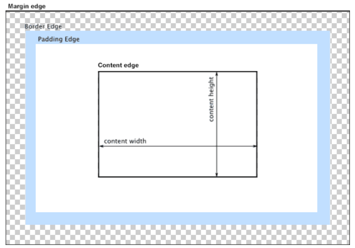
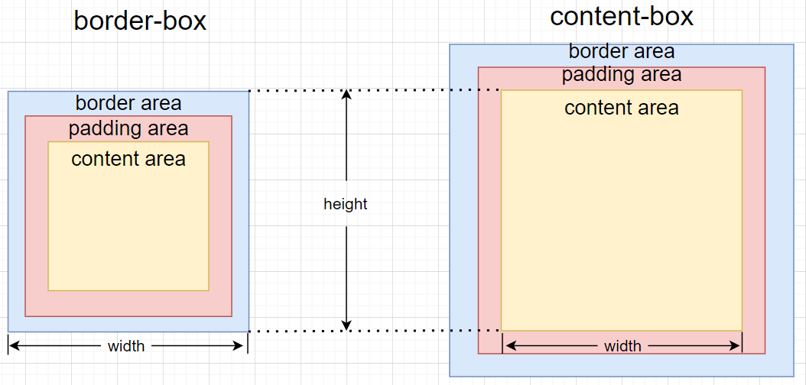

# CSS基础

## CSS 基础框盒模型

CSS basic box model

浏览器的渲染引擎会根据标准之一的 **CSS 基础框盒模型**，将所有元素表示为一个个矩形的盒子（box）。CSS 决定这些盒子的大小、位置以及属性（例如颜色、背景、边框尺寸…）

每个盒子由四个部分（或称*区域*）组成，其效用由它们各自的边界（Edge）所定义
与盒子的四个组成区域相对应，每个盒子有四个边界：*内容边界* *Content edge*、*内边距边界* *Padding Edge*、*边框边界* *Border Edge*、*外边框边界* *Margin Edge*



## 页面布局（三大核心）

### 盒子模型

#### 属性

##### 边框

###### 边框宽度

```css
border-width: 参数1 <参数2 <参数3 <参数4>>>
/*参数的取值 thin|medium|thick, length, inherit*/
/*当只使用一个参数时四个边框宽度一致*/
/*三个参数，上 左右一致 下*/
/*两个参数，上下一致 左右一致*/
/*四个参数分别定义 上 左 下 右 四个边框*/
```

###### 边框样式

```css
border-style: 参数1 <参数2 <参数3 <参数4>>>
/*参数的取值有 none|dotted|dashed|solid|double|groove|ridge|inset|outset|inherit*/
/*参数个数与其定义的边框之间的规律和上述一致*/
/*groove|ridge|inset|outset 其效果取决于border-color的值*/
/*hidden，与none效果相同，但应用于表时例外，用于解决边框冲突*/
```

###### 边框颜色

```css
border-color: 参数1 <参数2 <参数3 <参数4>>>
/*参数取值有 color_name hex_number rgb_number transparent inherit*/
/*参数个数与其定义的边框之间的规律和上述一致*/
/*注意：应始终把border-color声明在border-style之后，元素必须在您改变其颜色之前获得边框*/
/*但是好像border-style写在border-color之后也没什么？？？*/
```

###### 复合属性

```css
border: <width> <style> <color>
/*上述三个属性值的顺序可以随意，但建议按照上述顺序*/
/*取值也可为inherit*/
```

```css
/*复合属性分开四个边框的写法*/
border-top: <width> <style> <color>
border-bottom: <width> <style> <color>
border-left: <width> <style> <color>
border-right: <width> <style> <color>
/*都可以取值inherit*/
```

注意：如果不做任何处理（利用`box-sizing`），边框会额外增加盒子的实际大小

另外`border`样式的书写顺序对最终呈现的样式有影响：

```css
.example {
    width: 100px;
    height: 100px;
    border: 2px solid pink;
    border: red;
}
/*以上效果并不会使边框变为红色，而是什么都不显示
  因为第二个 border 缺省了边框宽度和样式，从而被设置为 0px 和 solid，导致上面设置的边框宽度被覆盖*/
```

###### 表格的细线边框

```css
/*即使<table>有一个border属性，但往往不用它设置边框*/
/*即使hidden可以用于解决边框冲突，但往往并不使用border样式来设置边框*/
/*而是用CSS中的 border-collapse: collapse;*/
```

###### CSS三角

主要利用边框颜色和边框宽度选项来实现用边框制作三角形的效果

```css
.trangle {
    width: 0; // 将高宽设置为0是必要的
    height: 0; 
    /* 接下来就利用边框宽度和边框颜色制作所需三角形的形状 */
    /* 例：
    border: 10px solid transparent;
    border-top-color: red;
    */
}
```

##### 圆角边框

```css
border-top-left-radius: %|length %|length
border-top-right-radius: %|length %|length
border-bottom-left-radius: %|length %|length
border-bottom-right-radius: %|length %|length
border-radius: 1-4%|length //这是简略写法
border-radius: 1-4%|length / 1-4%|length // 这是完整写法 左上 右上 右下 左下(水平半径) / 左上 右上 右下 左下(垂直半径)
/*省略部分参数时，采用对角线相等原则*/
/*具体写法有区分水平半径和垂直半径，水平半径采用%时，取宽度的%，垂直半径采用%时，取高度的%*/
/*采用简略写法（此时并没有特意去设置垂直半径）*/
/*
例子：
border-radius: 50px; >> 
border-radius: 50px 50px 50px 50px >> 
border-radius: 50px 50px 50px 50px / 50px 50px 50px 50px
*/
```

##### 边距

###### 内边距

```css
padding-top: 0px
padding-bottom: 0px
padding-left: 0px
padding-right: 0px
padding: 参数1 <参数2 <参数3 <参数4>>>
/*取值为 auto|length|percentage|inherit*/
/*percentage是基于父元素的宽度的百分比*/
/*padding只有1个参数时，上左下右*/
/*2个参数，上下 左右*/
/*3个参数，上 左右 下*/
/*4个参数，上 左 下 右*/
```

注意：

- 如果不做任何处理，内边距会撑大盒子。利用内边距可以制作自适应大小的盒子
- 当不设置width（或height）时，padding不会撑大盒子
- 布局时，左右一般使用padding，上下一般使用高与行高

###### 外边距

```css
margin-left
margin-right
margin-top
margin-bottom
margin: 参数1 <参数2 <参数3 <参数4>>>
/*取值为 auto|length|percentage|inherit*/
/*percentage是基于父元素的宽度的百分比*/
/*margin只有1个参数时，上左下右*/
/*2个参数，上下 左右*/
/*3个参数，上 左右 下*/
/*4个参数，上 左 下 右*/
```

注意：

- 可以利用margin使盒子水平居中——`margin: 0 auto`

  条件是：块级元素、有设置width、处于标准流中

  *行内元素间的居中利用`text-align: center`*

  *不在标准流的盒子需要通过一些技巧居中*

  ```css
  /*设置绝对或固定定位*/
  /*以下为部分设置方式，其他类似*/
  left: 50%;
  margin-left: - width/2 px;
  left: calc(50% - width/2px)
  
  top: 50%;
  margin-top: - height/2 px;
  ```

- 外边距合并（相邻的盒子）

  相邻的块元素会发生**垂直外边距**的合并
  通过**只给一个盒子添加外边距**的做法解决

- 外边距塌陷（嵌套的盒子）

  嵌套的块元素会发生垂直外边距的塌陷——这是在子元素上边框和父元素贴合的情况下

  解决：为父元素定义上边框；为父元素定义上内边距；为父元素添加`overflow: hidden`

*浮动的盒子不会有外边距合并或塌陷问题*

- 允许制定负的外边距值

###### 清除内外边距

```css
/*部分标签默认有内边距或外边距，这些会影响页面布局，一般要在布局前全部清除*/
* {
    margin: 0;
    padding: 0;
}
/*注意：通配符渲染效率低一些，所以有些网站只指定了多个标签来清除间距，而非全部*/
```

*注意：行内元素为了照顾兼容性，尽量只设置左右内外边距，但是转换为块级元素或行内块元素就可以按需求设置各种边距*

##### 盒子阴影

```css
box-shadow: h-shadow v-shadow <blur> <spread> <color> <inset>;
/*h-shadow: 水平阴影位置（允许负值），为必选值*/
/*v-shadow: 垂直阴影位置（允许负值），为必选值*/
/*blur: 模糊距离，为可选值*/
/*spread: 阴影尺寸（允许负值），为可选值*/
/*color: 阴影颜色（使用RGBA颜色可以制造出透明效果），为可选值*/
/*inset: 将外部阴影（outset）设为内阴影，为可选值——如果不写出 inset 则默认为 outset，无需显示书写outset，否则无法正常执行*/
```

##### 文字阴影

```css
text-shadow: h-shadow v-shadow <blur> <color>
```

---

传统页面布局的三种方式：
普通流（标准流）（标签按规定好的默认方式排列）、浮动、定位
普通流中的盒子通常用于竖向排列，浮动用于横向排列，而定位一般用于在页面中特定位置摆放盒子
传统页面布局的本质是用CSS摆放盒子

##### 盒尺寸（CSS3新特性）

```css
box-sizing: content-box(default)|border-box|inherit
/*content-box CSS盒子模型默认定义下，高宽只会应用到元素的内容区，在内容区之外添加边框和内边距*/
/*border-box 元素的高宽限定了一个边框盒，其边框和内边距添加在该边框盒内，实际的高宽要减去边框宽度和内边距宽度*/
```



### 定位

定位 = 定位模式 + 边移量

#### 定位模式

```css
position: static|relative|absolute|fixed|sticky|inherit
```

##### 静态定位

```css
position: static;
```

按照标准流特性摆放位置，没有边移量

##### 相对定位

```css
position: relative
```

相对自己原来的位置移动
原来的位置继续保留

##### 如果是浮动的元素可不可以进行相对定位？如果可以那么脱不脱标？（浮动元素本来就是脱标的）脱标这一说法准确？

浮动元素可以进行相对定位。我认为所谓脱不脱标的说法并不准确。浮动的元素本身就是脱离标准流的，而给浮动的元素设置相对定位属性，在其有偏移后，仍保留原有位置，所以不脱标并不等同于保留原有位置，反之，脱标了也不能说就不保留原有位置了。不准确！！！

如果按照我自己的理解，应该是使用了相对定位的元素，在定位移动之后保留了在相应的流中的位置，并且只会影响在同一流中元素的布局，比如在标准流中的元素使用了相对定位移动后仍占有原有位置，但不会影响浮动元素继续占有这个位置，但是如果浮动元素使用了相对定位移动后，使用了相对定位的浮动元素仍占有浮动元素流中原有位置，其他浮动元素不能占有这个位置

##### 绝对定位

```css
position: absolute;
```

**相对于祖先元素移动**
若无祖先元素或祖先元素无定位，以浏览器为准来定位；若有，则以最近一级的有定位祖先元素为参考点移动
绝对定位不再占有原先的位置

##### 固定定位

```css
position:fixed;
```

固定于浏览器的某个可视位置
以浏览器的可视窗口为参照点移动元素，于父元素无关，不随滚动条滚动
不占有原先位置

###### 附：一个固定定位技巧

固定在版心右侧，其他方向类似

```css
position: fixed;
left:50%;
margin-left: //版心宽度的一半
```

##### 粘性定位

```css
position: sticky;
```

*粘性定位的兼容性较差，粘性定位的效果一般用 js 实现*

粘性定位的元素是依赖于用户的滚动，在`position:relative`与`position:fixed`定位之间切换：
当页面未超出目标区域，表现为相对定位；当页面滚动超出目标区域，表现为固定定位
元素定位表现为在**跨越特定阈值**前为相对定位，之后为固定定位

```css
/*例*/
position: sticky;
top: 0px;
/*此时若某盒子设置了上述样式，如果盒子的顶端距离浏览器视窗顶部大于0px时，表现为相对定位，
  当用户滚动视窗导致盒子上移至盒子顶端与视窗顶部距离为0px时，表现为固定定位*/
```

#### 边移量

```css
top, bottom, right, left
/*相对于原来参照边的偏移*/
/*可取值为 length % auto inherit*/
/*length 与 % 可取负值*/
```

#### 定位叠放顺序

```css
z-index: num;
/*取值可为 正整数 负整数 0，默认值为 auto */
/*元素的定位与文档流无关，所以它们可以覆盖页面上的其它元素，具有更高堆叠顺序的元素总是在较低堆叠顺序下面，即 值大靠上 */
/*如果两个定位元素重叠，且堆叠顺序值一致或没有设置堆叠顺序时，最后定位在代码中的元素显示在最上面*/
```

### 浮动

浮动的盒子会**脱离标准流**，这就脱离了标准流的控制从而可以移（浮）动到指定位置；
浮动的盒子**不会保留（在标准流中）原来的位置**（会形成上下相叠的效果，浮动盒子在上）；
多个盒子若都设置了浮动，则它们会**按属性值在一行内显示并且顶端对齐排列**；
浮动元素**具有行内块元素特性，但盒子之间无间隙**

```css
float: none|left|right|inherit
```

*以往这个属性总应用于图像，使文本围绕在图像周围，不过在 CSS 中，任何元素都可以浮动*
**浮动元素会生成一个块级框**，而不论它本身是何种元素（即具有行内块元素特性）

浮动元素搭配标准流父盒子使用——约束浮动元素位置
一般的页面布局准则是：标准流的父元素排列上下位置，之后子元素采取浮动排列左右位置

#### 清除浮动

##### 原因

浮动元素通常配合一个标准流父元素使用，往往需要给定父元素高度，否则如果父元素不给定高度（`height=0px`），下方浮动元素则会往上走，影响排版；但若给了高度，若子元素数量不定，定下了高度则无法灵活地装入任意数量的浮动子元素且影响排版，或某个子元素高度超出父容器高度造成浮动溢出影响排版

清除浮动可以起到使任意数量的浮动子元素装入标准流父元素时，而不影响排版的作用——即**实现非浮动父元素对浮动子元素的高度自适应**（非浮动父元素本身只会对非浮动子元素进行高度自适应）

##### 闭合浮动

清除浮动采用的策略是闭合浮动

###### 实现方法

- 额外标签法

  在浮动元素末尾加上一个空标签

  ```html
  <!-- 例 -->
  <div style="clear: both"></div>
  <!-- 或者 -->
  <br style="clear: both"/>
  <!-- 或其他块级元素等等 -->
  ```

  这样的方法通俗易懂，但多了无意义标签，结构性差

- `::after`伪元素

  给父元素添加

  ```css
  .clearfix::after {
      content:" "; /*content:"."; 或 content:""; */
      display:block;
      height:0;
      visibility: hidden;
      clear: both;
  }
  ```

  使用`content:"."`或者为`content:" "`在元素的后面生成了内容为一个点的**块级元素**，并使用一切方法**使这个块级元素隐藏**并**清除浮动`clear:both`**

- 双伪元素

  给父元素添加

  ```css
  .clearfix::before,
  .clearfix::after {
      content: "";
      display: table; // 为了使两个伪元素盒子在一行形成闭合
  }
  .clearfix::after {
      clear:both;
  }
  ```

*注：以上的`.clearfix`类名并非强制使用，只是一种默认的规范*

*还有其他的实现方式，以上三个为常用方法*

采用了以上方法实现清除浮动（闭合浮动）后，父元素一般都不再设置高度

### 定位或浮动元素的特殊属性

- 行内元素使用了绝对或固定定位，或设置了浮动（都脱离了标准流），可直接设置高宽
- 块级元素使用了绝对或固定定位，如果不设置高宽，默认大小为内容大小（结合第一点可见使用了定位的元素都“变为”行内块元素）
- 脱标的盒子不会触发外边距合并问题
- 浮动元素不会压住标准流的文字（图片）（浮动最初的目的就是为了制造文字环绕效果）
  绝对或固定定位元素会压住标准流的文字（图片）
  相对或粘性定位移动后可以压住文字（图片）

### 页面布局整体思路

- 确认版心
- 分析行模块 >> 每个行模块中的列模块
- 列模块常为浮动布局 >> 先列大小后列位置
- 先使用HTML结构进行构建，再使用CSS样式

布局的小技巧：

- `<li>`与`<a>`配合使用，利用链接伪元素`a:hover`设置悬浮样式有利于优化超链接点击前的显示效果
- 间距布局：嵌套关系的盒子，**子元素尽量不用设置`width`**；**父子关系的盒子间距使用`padding`设置**，**兄弟关系的盒子间距使用`margin`**

