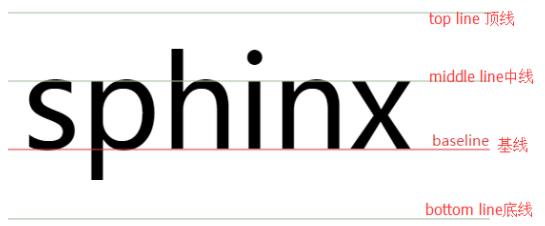

# CSS基础

## 元素的显示与隐藏

### display

```css
display: none|block|inline(default)|inline-block|table|......|inherit
/*以上几个是目前初级阶段比较常用的，还有多个取值未列出*/
/*display: none; 可以隐藏元素，但不再占有原来位置*/
```

### visibility

```css
visibility: visible(默认)|hidden|collapse|inherit
/*visibility: hidden; 可以隐藏元素，并且继续占有原来位置*/
/*collapse 当在表格元素中使用时，此值可删除一行或一列，但是它不会影响表格的布局
  被行或列占据的空间会留给其他内容使用。如果此值被用在其他的元素上，会呈现为 "hidden"*/
```

### overflow

```css
overflow: visible|hidden|auto|scroll|inherit
/*这个属性设置是否显示内容溢出部分，以及显示方式*/
/*visible 不修剪内容，显示溢出部分*/
/*hidden 修剪内容，隐藏溢出部分*/
/*auto 如果内容被修剪，浏览器会显示滚动条以便查看剩余内容——只显示需要的滚动条（水平或垂直滚动条或两者都有）*/
/*scroll 如果内容被修剪，浏览器会显示滚动条以便查看剩余内容——直接显示所有滚动条*/
```

## 精灵图

为了减少服务器接收和发送请求的次数，提高页面加载速度 >> **CSS精灵技术（CSS Sprites、CSS雪碧）**

精灵技术主要针对背景图片的使用，具体就是将多张小尺寸背景图片合成一张大图（精灵图），然后定好选框位置，将精灵图作为背景图片，然后通过背景定位（`background-position`）移动背景图片，显示需要的部分

缺点：文件较大，本身放大或缩小会失真，图片制作完毕要更换比较复杂

## 字体图标（iconfont）

提供了一种高效的图标使用方式
展示为图标，本质是字体
优点：轻量级，灵活性，兼容性
但仍然无法替代精灵图

使用的具体过程：
下载字体图标（如在[阿里巴巴矢量图标库下载](https://www.iconfont.cn/?spm=a313x.7781069.1998910419.d4d0a486a)）>> 引入到HTML页面 >> 追加小图标

将字体图标引入到HTML页面有三种方式，这里介绍最常用的 “Font Class” 引入方式，其余两种详见阿里巴巴矢量图标库下载图标时附带的图标引入介绍

Font Class中引入方式比较直观：

第一步：引入项目下面生成的`fontclass`代码

```css
<link rel="stylesheet" href="/path/to/iconfont.css">
```

第二步：挑选相应图标获取类名，应用于页面

```css
<span class="iconfont icon-xxx"></span>
```

## CSS用户界面样式

### 鼠标样式

```css
cursor: default|pointer|move|text|not-allowed
/*取值还有多个*/
```

### 轮廓线

```css
outline-color: color_name|hex_num|rgb|invert(default)|inherit  /*并非所有浏览器都支持 invert*/
outline-style: none(default)|dotted|dashed|solid|double|groove|ridge|inset|outset|inherit
outline-width: thin|medium(default)|thick|length|inherit
outline: <color> <style> <width>
/*outline（轮廓）是绘制于元素周围的一条线，位于边框边缘的外围，可起到突出元素的作用*/
/*轮廓线不会占据空间，也不一定是矩形*/
/*属性值可以不按顺序*/
```

### 调整元素尺寸

```css
resize: none|both|vertical|horizontal
/*规定是否可由用户调整元素的尺寸*/
/*常见文本框拖拽控制（textarea）*/
```

### 垂直对齐

这个属性只对**行内元素**有效
用来指定行内元素（inline）或表格单元格（table-cell）元素的垂直对齐方式

重要参考：<https://christopheraue.net/design/vertical-align>

```css
vertical-align: baseline(default)|middle|top|bottom|text-top|text-bottom|sub|super|length|%|inherit
/*这其中的原理需要进行理解，主要要理清 line-box 的 top、bottom 和 baseline 以及该行的行内（块）元素的 top、bottom 和 baseline */
```



### 溢出文字省略号

#### 单行文本

分为三步：

```css
white-space: nowrap; // 强制不换行
overflow: hidden; // 隐藏溢出
text-overflow: ellipsis; // 文字用省略号代替
```

#### 多行文本(参考)

*一般由后台人员设置，操作比较简单*

*以下做法有较大兼容性问题，适合于`webkit`浏览器或移动端*

```css
overflow: hidden;
text-overflow: ellipsis;
display: -webkit-box; // 弹性伸缩盒子模型显示
-webkit-line-clamp: 2; // 限制文本行数
-webkit-box-orient: vertical; // 设置或检索伸缩对象的子元素排列方式
```

