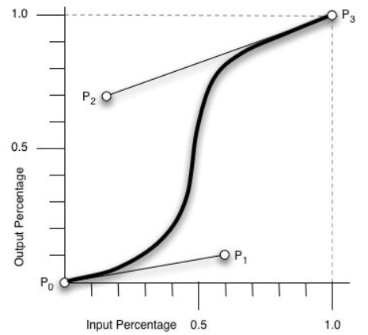
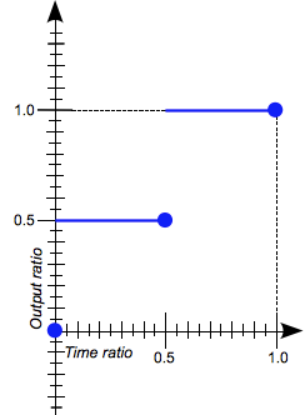
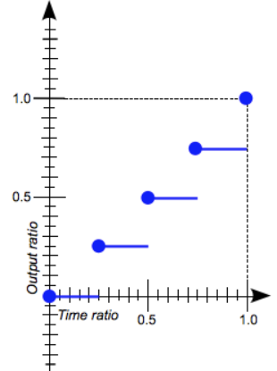
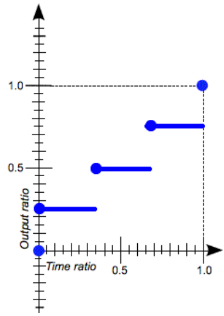
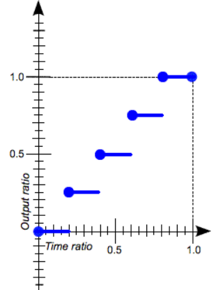
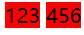

# CSS基础

## 滤镜（未完成）

```css
filter: url("filters.svg#filter-id");
filter: <filter-function>(values);
filter: <filter-function>(values) <filter-function>(values) ...; // 多个过滤器
filter: none|inherit|initial|unset
```

## calc()

calc() 此 CSS 函数允许在声明 CSS 属性值时执行一些计算。它可以用在如下场合：length、frequency、angle、time、percentage、number 或 integer

```css
calc(<param>)
/*一般用表达式来作为它的参数，以表达式的结果作为值*/
/*可以使用的操作符有 + - * */
/*当 + 和 - 作为双目运算符时，两边必须要有空白字符，否则可能无法正确解析*/
/*当 + 和 - 作为单目运算符时，右边不可有空格*/
/** 和 / 这两个运算符前后不需要有空白字符，考虑到统一性一般都会加上*/
/** 的操作数中至少有一个是 number，/ 的右侧操作数必须是 number */
/* 0 作除数会使HTML解析器抛出异常*/
/*表达式中的运算对象可以使用任意的 length 值 —— 可以在一个表达式中混用不同单位*/
/*可以用小括号来建立计算顺序*/
/*calc()可以嵌套使用，但被嵌套的calc()都将会直接被扁平化为一个对小括号*/
```

## 过渡

**过渡属性**列表为“主列表”，其他过渡相关的单一属性以此为准给出相应属性值，当属性值与过渡属性列表中的值的数目不等，会有各自的规则对之进行处理

### 过渡属性

```css
transition-properties: none|[all(default)|IDENT]#;
/*IDENT 为属性名称，由小写字母 a-z ，0-9 和下划线 _ 和 破折号 - 。第一个字符不能为数字，不能两个破折号开头*/
/*指定应用过渡属性的名称*/
/*多个属性值用英文逗号分隔*/
```

### 过渡持续时间

```css
transition-duration: <time>#;
/*取值以秒或毫秒为单位，默认为 0s */
/*指定动画持续时间*/
/*多个值用英文逗号分隔*/
/*当列表中值的个数少于主列表中值的个数，列表中的值将被重复以匹配主列表中的值*/
/*当列表中值的个数多于主列表中值的个数，多余的值直接被忽略*/
/*
例：
主列表：transition-properties: margin-right, height, width, padding-top;
transition-duration: 1s, 2s; >> transition-duration: 1s, 2s, 1s, 2s;
transition-duration: 1s, 2s, 300ms, 0.5s, 5s; >> 直接忽略 0.5s 以后的值
*/
```

### 过渡定时函数

```css
transition-timing-function: [linear|<cubic-bezier-timing-function>|<step-timing-function>]#;
/* 默认值为 ease */
/* <cubic-bezier-timing-function> = ease|ease-in|ease-out|ease-in-out|cubic-bezier(<number>, <number>, <number>, <number>) */
/*<step-timing-function> = step-start|step-end|steps(number_of_steps, direction)*/
/*其取值为一些定时函数，每个函数会建立一个加速度曲线*/
/*控制动画的速度在动画过程中的改变方式*/
/*多个属性值用英文逗号分隔*/
/*当列表中值的个数少于主列表中值的个数，缺少的值将被设置为 ease */
/*当列表中值的个数多于主列表中值的个数，多余的值直接被忽略*/
/*
例：
主列表：transition-properties: margin-right, height, width, padding-top;
transition-timing-function: linear, ease-in; >> transition-timing-function: linear, ease-in, ease, ease;
transition-timing-function: linear, ease-in, ease-in, ease, ease-out; >> 直接忽略 ease 以后的值
*/


/*支持的定时函数有：立方贝塞尔曲线的子集 和 阶梯函数 */
/* 
cubic-bezier(x1, y1, x2, y2)中的四个参数均为<number>类型的值，表示P1和P2的横坐标和纵坐标
cubic-bezier()，缓动函数（easing functions），定义了一条立方贝塞尔曲线，其需要四个点P0，P1，P2，P3来定义，P0和P3是起点和终点，P0(0, 0)和P3(1, 1)是CSS中规定的值，因为并非所有的立方贝塞尔曲线都是数学函数（并非都适合作为计时函数），而这样的规定将其作些限制以适合作为计时函数
当且仅当P1和P2的 横坐标 都在 [0, 1] 范围内时，三次贝塞尔曲线才是有效的，纵坐标的取值没有规定，但也毋须过大
*/
/*
steps(number_of_steps, direction)
number_of_steps 取值为正整数，表示组成步进函数的等距踏板的数量
direction 取值为start|end，start表示左连续，end表示右连续，该参数可以省略，默认为 end 
jump-start/start: 第一步在动画开始时发生，起始位置发生阶跃
jump-end/end: 最后一步在动画结束时发生，终止位置发生阶跃
jump-both: 起止位置都会发生阶跃
jump-none: 起止位置都不会发生阶跃
*/
/* cubic-bezier()是从一种状态连续地变化到另一种状态，而steps()是将动画的过渡分割成段，跳跃性地变化 */
/*
常用的定时函数关键字：
linear: cubic-bezier(0.0, 0.0, 1.0, 1.0)  动画会以恒定的速度从初始状态过渡到结束状态
ease: cubic-bezier(0.25, 0.1, 0.25, 1.0)  在开始时加速地更快，但在接近中间中，加速开始变慢
ease-in: cubic-bezier(0.42, 0.0, 1.0, 1.0)  动画开始时缓慢，然后逐步加速，直到达到最后状态，动画突然停止
ease-out: cubic-bezier(0.0, 0.0, 0.58, 1.0)  动画开始很快，然后逐渐减慢，直到最终状态
ease-in-out: cubic-bezier(0.42, 0.0, 0.58, 1.0)  动画开始的行为类似于 ease-in 函数，动画结束时的行为类似于 ease-out函数
step-start: steps(1, start)  动画会立刻跳转到结束状态，并一直停留在结束状态直到动画结束
step-end: steps(1, end)  动画会一直保持初始状态直到动画结束，然后立刻跳转到结束状态
*/
/* 具体参考：https://developer.mozilla.org/zh-CN/docs/Web/CSS/timing-function */
```











### 过渡延迟时间

```css
transition-delay: <time>#
/*取值以秒或毫秒为单位，默认值为 0s */ 
/*规定了在过渡效果开始作用之前需要等待的时间*/
/*多个属性值用英文逗号分隔*/
```

### 过渡复合属性

```css
transition: [[none|<*-properties>] || <*-duration> || <*-timing-fuction> || <*-delay>]#;
/*transtion 为上述四个属性值对应属性的复合属性*/
/*transition属性可以被指定为一个或多个 CSS 属性的过渡效果，多个属性之间用英文逗号进行分隔*/
/*可以解析为时间的第一个值被分配给*-duration，并且可以解析为时间的第二个值被分配给*-delay*/
```

***注意：过渡的相关属性常和伪元素或伪类（如`:hover`等）配合使用，而过渡的相关属性应加到元素需要有过渡的部分的样式中（谁有过渡给谁加）***

## 一些布局技巧

### margin 负值

```css
/* 针对有边框的浮动盒子在进行同一行中的列布局时，由于相邻盒子边框相邻使得看起来比较粗的情况 */
margin-left: - <border-width>px /* 左侧第一个浮动盒子不需要修改外边距 */
```

### 悬浮效果

悬浮效果使用到`:hover`，`z-index`和相对定位
注意：`z-index`只能在定位元素上生效；使用相对定位是因为在盒子浮动时仍可以占据原有位置

```css
// 例子
// 悬浮效果为边框变色
.box {
    width: 100px;
    height: 200px;
    float: left;
    position: relative;
    background-color: magenta;
    border: 1px solid #eeeeee;
    margin-left: -1px;
}
.box:first-child {
    margin-left: 0px;
}
.box:hover {
	z-index: 1;
    border: 1px solid #00ff00;
}
```

### 文字围绕效果

利用浮动元素不会压住文字的特性

### 行内块元素的运用

利用行内（块）元素在源码中换行或之间有空白字符，导致布局时元素之间会有间距的特点，不必设置外边距，直接使用`text-align:center`水平居中

要消除以上问题导致的间距问题可以使用以下方式

```html
<!--行内（块）元素间如果对应的代码有换行或其他空白字符，则还是有上下、左右间距，
  解决方法为在两个行内（块）元素标签间加注释符再换行
  例：-->
	<span>123</span><!--
--><span>456</span>
```




## CSS初始化

以下是一些常见的CSS初始化代码

```css
/* 把我们所有标签的内外边距清零 */
* {
    margin: 0;
    padding: 0
}
/* em 和 i 斜体的文字不倾斜 */
em,
i {
    font-style: normal
}
/* 去掉li 的小圆点 */
li {
    list-style: none
}

img {
    /* border 0 照顾低版本浏览器 如果图片外面包含了链接会有边框的问题 */
    border: 0;
    /* 取消图片底侧有空白缝隙的问题 */
    vertical-align: middle
}

button {
    /* 当我们鼠标经过button 按钮的时候，鼠标变成小手 */
    cursor: pointer
}

a {
    color: #666;
    text-decoration: none
}

a:hover {
    color: #c81623
}

button,
input {
    /* "\5B8B\4F53" 就是宋体的意思 这样浏览器兼容性比较好 */
    font-family: Microsoft YaHei, Heiti SC, tahoma, arial, Hiragino Sans GB, "\5B8B\4F53", sans-serif
}

body {
    /* CSS3 抗锯齿形 让文字显示的更加清晰 */
    -webkit-font-smoothing: antialiased;
    background-color: #fff;
    font: 12px/1.5 Microsoft YaHei, Heiti SC, tahoma, arial, Hiragino Sans GB, "\5B8B\4F53", sans-serif;
    color: #666
}

.hide,
.none {
    display: none
}
/* 清除浮动 */
.clearfix:after {
    visibility: hidden;
    clear: both;
    display: block;
    content: ".";
    height: 0
}
.clearfix {
    *zoom: 1
}
```

## favicon 图标（未完成）

favicon（`.ico`）一般用于作为缩略的网站标志，显示在浏览器的地址栏或标签上

### 引入方式

```html
<link rel="icon" href"/path/to/favicon"/>
<!-- 本地测试时，在部分浏览器上可能无法正常显示 -->
<!-- 这是一种基本的引入方式，实际上还有其他操作 -->
<!-- 要获取一个网站的favicon，可以通过链接获得："the/domain/name/of/the/website/favicon.ico" -->
```

## SEO

Search Engine Optimization, 搜索引擎优化，是一种利用搜索引擎规则让网站在搜索引擎结果中更加清晰，提高网站在有关搜索引擎内自然排名的方式

搜索引擎为SEO提供了一些指导，但大型搜索引擎将结果排名保持为商业秘密。SEO结合了官方搜索引擎指南，经验知识和科学论文或专利的理论知识

### TDK的SEO优化

这里的TDK是指：

- Title: 具体指页面头部的`<title></title>`中的内容
  具有不可替代性
  是内页的第一个重要标签，是搜索引擎了解网页的入口和网页主题归属的最佳判断点

- Description: 具体指头部中的`<meta name="description" content="<描述内容>">`
  简要说明网站主要是做什么的

- Keywords: 具体是指头部中的`<meta name="keywords" content="<keyword 1>, <keyword> 2, ...">`

  是页面关键词，是搜索引擎的关注点之一

  最好限制为6到8个关键词，关键词间用**英文逗号**隔开

### 网页LOGO的SEO优化（未完成）

具体做法如下：

1. LOGO中放一个`<h1>`标签（为了提权，告诉搜索引擎这很重要）
2. `<h1>`标签里放一个`<a>`标签
3. `<a>`标签里放文字（网站名称）
   文字不能显示出来，方法有：
   - `text-indent: -9999px;`和`overflow: hidden;`
   - 直接`font-size:0;`
   - 还能使用其他方法吗？例如`color: transparent;`
4. 给链接一个`title`属性（这样鼠标放在LOGO上就能看到提示文字）

### 注册页的SEO：

**注册页不要有任何的SEO优化**（注册页面比较隐私，为了保护用户隐私，不作优化）