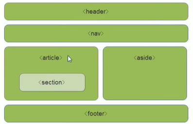

# HTML提高

## HTML5新特性

### 新增的语义化标签

`<div>`对搜索引擎来说是没有语义的，以下标签作用等同于`<div>`但含有特定语义

```html
<header></header>
<nav></nav>
<article></article>
<section></section>
<aside></aside>
<footer></footer>
```

注意：
这些语义化标签主要是针对搜索引擎的
页面中这些新标签可以使用多次
移动端更常使用这些标签



### 新增的多媒体标签

#### 视频标签

```html
<video></video>
<!-- video标签的重要属性：-->
src: 视频url，支持的视频格式有MP4，WebM，ogg
autoplay: 自动播放
loop: 循环播放
preload: 视频在页面加载时进行加载的方式，取值为 none（不载入视频），meta（载入元数据），auto（载入整个视频）。当设置了autoplay时忽视该属性
poster: 图片url，视频下载时显示的图像
width: 视频播放器宽度，单位为 px，可以直接只设置数字不带单位。另外经测试还可以使用%
height: 视频播放器高度，单位为 px，可以直接只设置数字不带单位。另外经测试还可以使用%
muted: 规定初始时视频静音播放
controls: 视频播放器控件。在不同的浏览器控件的样式可能不同，可以不用这个属性，而是用js统一样式
<!-- 注意width和height设置的时视频播放器视窗的高宽，视频会按自身比例自动缩放来将视频画面完全放入视窗中，而不会变形 -->
<!-- 当在视频标签之间放置文本时，只有当浏览器不支持标签的信息时才会显示该文本内容 -->
```

*注：可以在开始标签和结束标签之间放置文本内容，这样老的浏览器就可以显示出不支持该标签的信息*

由于不同浏览器支持的视频格式可能不同，可以采用以下方式来为浏览器提供多个视频播放选项：

```html
<!-- 提供了三个视频选项和一个文本提示信息，只有当三个视频格式都无法正常播放时才会输出文本提示信息 -->
<video controls autoplay>
	<source src="movie.ogg" type="video/ogg" />
    <source src="movie.mp4" type="video/mp4" />
    <source src="movie.webm" type="video/webm" />
    Your browser does not support the video tag.
</video>
```

#### 音频标签

```html
<audio></audio>
<!-- audio标签的重要属性： -->
src: 音频url，支持的音频格式有mp3，wav，ogg
autoplay: 自动播放
loop: 循环播放
preload: 音频在页面加载时进行加载的方式，取值为 none（不载入音频），meta（载入元数据），auto（载入整个音频）
muted: 静音
controls: 音频播放器控件
<!-- 音频标签没有width和height属性，需要通过CSS样式设置 -->
```

*注：可以在开始标签和结束标签之间放置文本内容，这样老的浏览器就可以显示出不支持该标签的信息*

与音频标签中的做法类似，可以通过相似做法为浏览器提供多个音频播放选项：

```html
<audio>
	<source src="song.ogg" type="audio/ogg"/>
	<source src="song.mp3" type="audio/mp3"/>
	<source src="song.wav" type="audio/wav"/>
    Your browser does not support the audio element.
</audio>
```

