# 移动端

大多移动端浏览器都是根据`webkit`修改过来的——兼容移动端主流浏览器，处理`webkit`内核浏览器即可

手机屏幕现状：移动端设备屏幕尺寸非常多，碎片化严重；分辨率有多种（720&times;1080，1080&times;1920等）（开发者无需关注分辨率，因为使用的单位为`CSS px`）

*device pixels 指的是设备屏幕的物理像素，任何设备的物理像素数量都是固定的*
*CSS pixels 是 CSS 和 JS 中使用的一个抽象概念。它和物理像素之间的比例取决于屏幕的特性（是否为高密度）以及用户进行的缩放，由浏览器自行换算*

<https://material.io/blog/device-metrics>

## 移动端调试方式

浏览器`devtools`

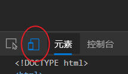

将浏览器设备仿真切换到移动设备后，再在该模式下选择移动设备类型并输入某个网址，会发现页面自动切换为移动端页面（会发现域名也自动切换了）
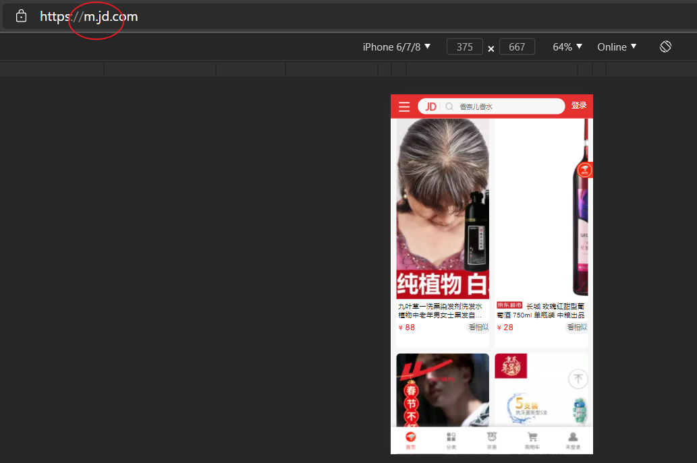

## 视口

`viewport`，是指浏览器显示页面内容的屏幕区域，视口可以分为布局视口、视觉视口和理想视口

重要参考：
<https://www.jianshu.com/p/7c5fdf90c0ef>
<https://www.quirksmode.org/mobile/>

### 布局视口

layout viewport，用于早期的PC端页面在手机上显示的问题，一般移动设备的浏览器都把视口设置了一个较宽的值（如 980px），这样即使是为PC端设计的网页也能在移动端上正常显示，把这种视口称为布局视口
但有一个显著的缺陷：PC端的页面在移动端上显示时，页面元素看上去很小，需要通过手动缩放页面来查看

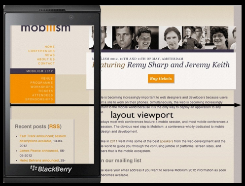

### 视觉视口

visual viewport，是用户正在看到的**网站的区域**，可以通过缩放去操作视觉视口，但不会影响布局视口，布局视口仍保持原来的宽度

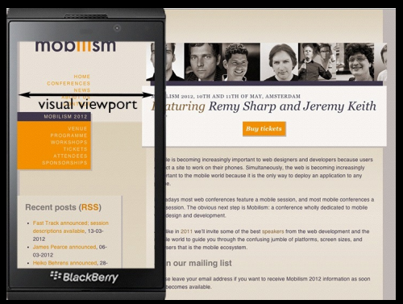

*以上两种视口配合使用以便在移动端上查看PC端的网页，需要用户缩放和横向滚动条来查看网站所有内容*

### 理想视口

ideal viewport，为了使网站在移动端有最理想的浏览和阅读宽度而设定
现在越来越多的网站都会为移动设备进行单独的设计，所以必须还要有一个能完美适配移动设备的viewport（不需要用户缩放和横向滚动条就能正常的查看网站的所有内容；显示的文字的大小是合适的）
ideal viewport 并没有一个固定的尺寸，不同的设备拥有有不同的 ideal viewport

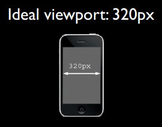

**需要手动添写`meta`视口标签通知浏览器操作**
`meta`视口标签的主要目的：布局视口的宽度应该与理想视口的宽度一致 

### `meta`视口标签

移动设备默认的 viewport 是 layout viewport，也就是那个比屏幕要宽的 viewport ，但在进行移动设备网站的开发时，我们需要的是 ideal viewport。那么怎么才能得到 ideal viewport 呢？这就该轮到meta标签出场了

```html
<meta name="viewport" content="width=divice-width, user-scalable=0, initial-scale=1.0 , maximum-scale=1.0, minimum-scale=1.0">
<!-- 
	width：layout viewport 宽度，可以设置特殊值 device-width 
	(缩放是对页面进行缩放，是相对于 ideal viewport 来进行缩放的)
	initial-scale：初始缩放比，大于 0 的数字
	maximum-scale：最大缩放比，大于 0 的数字
	minimum-scale：最小缩放比，大于 0 的数字
	user-scalable：用户是否可以缩放，yes 或 no （1 或 0）

	当页面设置的宽度 width 和 缩放出的宽度 大小不一致时，浏览器会取它们两个中较大的那个值

	要把当前的viewport宽度设为ideal viewport的宽度，既可以设置 width=device-width，也可以设置 initial-scale=1
	但这两者各有一个小缺陷，就是iphone、ipad以及IE 会横竖屏不分，通通以竖屏的ideal viewport宽度为准。所以，最完美的写法应该是，两者都写上去，这样就 initial-scale=1 解决了 iphone、ipad的毛病，width=device-width 则解决了IE的毛病
-->
```

## 多倍图

用于提高图片质量，解决图片在高清设备中的模糊问题——本质就是将一个实际尺寸较大的图片在应用时按倍数缩小为尺寸较小的目标尺寸的图片使用（如一个图片布局的尺寸为 50 &times;50px ，使用一个实际尺寸为 100&times;100px 的图片——二倍图）

对于一种图片，在移动端的 Retina 屏中打开，按照物理像素比（物理像素数 / CSS 像素数）放大倍数会造成图片模糊。通常使用二倍图。

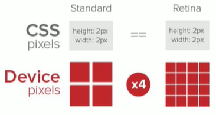

### 背景多倍图

```css
/*使用到以下属性*/
background-size: w <h>|contain|cover
```

### 二倍精灵图

实际上就是将精灵图按原来尺寸缩放为原来的二分之一后，再按缩小后的尺寸移动作为背景图片的精灵图

```css
/* 例如 
   一个精灵图原来大小为 300x200px ，精灵图所需使用部分所处位置距离 精灵图左上角（背景图默认应用起点） 水平50px 垂直50px ，则背景图定位应该为 */
background-position: -50px -50px

/* 当一个精灵图需要当作二倍图来使用时，则需要设置 */
background-size: 150px auto;
/* 此时背景图定位应该为 */
background-position: -25px -25px;
```

## 移动端开发选择

- **单独制作移动端页面**（主流）
- **响应式页面兼容移动端**——需要花很大精力调兼容性问题

## 移动端常见布局

单独制作移动端页面：流式布局、flex布局、rem适配布局；
制作的同一个页面根据设备屏幕尺寸呈现不同的页面布局：响应式布局

### 流式布局

即百分比布局（非固定像素布局），通过**盒子的宽度设置成百分比**来根据屏幕的宽度来进行伸缩，不受固定像素限制，内容往两侧填充

为了使盒子在根据屏幕的宽度进行伸缩时不会过大或过小，会设置一个最大或最小宽度：

```css
min-width:
max-width: 
/*同时也有最大或最小高度*/
min-height:
max-height:
/* 此时应该把宽度 width 设置为 100% */
/* 例：
	width: 100%;
	min-height: 320px;
	max-height: 640px; */
```

实现中间盒子自动伸缩效果（flex布局也可实现该效果）

```css
.container {
    position: relative;
    width: 60%;
    height: 100px;
    margin: 0 auto;
    background-color: pink;
}
.container div:nth-child(2n+1) {
    position: absolute;
    width: 100px;
    height: 100px;
    top: 0;
    background-color: red;
}
.container div:nth-child(2) {
    height: 100px;
    margin: 0 100px;
    background-color: green;
}
.container div:nth-child(1) {
    left: 0;
}
.container div:nth-child(3) {
    right: 0;
}
```

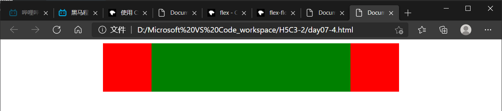

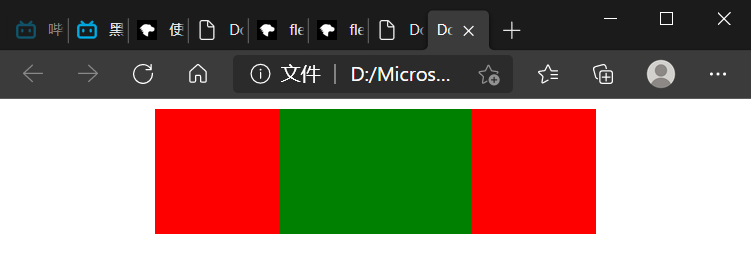

### flex布局

通过给父盒子添加`display: flex`，来控制子盒子的位置和排列方式

```css
/* 给父元素写上以下该属性，将父盒子设为flex布局。此时子元素的float、clear 和 vertical-align 属性将失效 */
display: flex;
```

flex 是 flexible box 的缩写，**flex布局**用来为盒状模型提供最大的灵活性，任何一个容器都可以指定为flex布局
伸缩布局 = 弹性布局 = 伸缩盒布局 = 弹性盒布局 = flex布局

采用flex布局的元素称为**flex容器（flex container）**，简称**容器**。其所有子元素自动成为容器成员，称为**flex项目（flex项目）**，简称**项目**。

操作方便，布局极为简单，在移动端应用广泛，但在某些PC端浏览器的支持情况较差（如IE11或更低版本，*正经人家谁用啊*）

*注：如果是PC端页面布局，建议使用传统布局，如果是移动端或不考虑兼容性问题的PC端页面布局，建议使用flex布局*

#### 弹性盒子相关概念（未完成）

参考：<https://developer.mozilla.org/zh-CN/docs/Web/CSS/CSS_Flexible_Box_Layout/Using_CSS_flexible_boxes>

##### 轴（Axis）

每个弹性框布局包含两个轴：弹性项目沿其依次排列的那根轴称为**主轴(main axis)**。垂直于**主轴**的那根轴称为**侧轴(cross axis)**

#### flex布局父项常见属性

##### 主轴方向

```css
flex-direction: row(default)|row-reverse|column|column-reverse
/* 
row: flex容器的主轴被定义为与文本方向相同。主轴起点和主轴终点与内容方向相同。
row-reverse: 表现和row相同，但是置换了主轴起点和主轴终点
注意：row 和 row-reverse 定义的方向与flex容器的方向性 direction 的取值有关（rtl 或 ltr(default)），当dir取值为 ltr ，row表示从左到右的水平轴，否则从右到左，row-reverse的效果则总与row相反

column: flex容器的 主轴 和 块轴 相同。主轴起点与主轴终点和书写模式的前后点相同
column-reverse: 表现和column相同，但是置换了主轴起点和主轴终点
*/
```

##### 项目沿主轴排列方式

该属性使用前需要正确设置主轴

``` css
justify-content: flex-start(default)|flex-end|center|space-between|space-around
/*取值不止以上5个，以上5个为常用值*/
/*
flex-start: 项目向主轴起点对齐
flex-end: 项目向主轴终点对齐
center: 项目沿主轴方向居中
space-between: 在主轴上均匀分布项目，相邻元素距离相同，且首尾项目分别对齐主轴起点和终点
space-around: 在主轴均匀分布项目，相邻元素间距离相同，且首尾项目分别到达主轴起点和终点的距离为相邻元素距离的一半
*/
```

##### 项目换行

```css
flex-wrap: nowrap(default)|wrap|wrap-reverse;
/*
nowrap: 此时不会换行，只会“强行将所有元素挤入容器”（见下面的例子）
wrap: 换行后，项目会在无法容纳项目时被打断到沿侧轴方向的队列中，换行后的多个队列的排序方式取决于侧轴的起点和终点位置，即取决于主轴方向 flex-direction 的设置
wrap-reverse: 和 wrap 行为一样，只是侧轴的起点（cross-start）和终点（cross-end）互换
*/
```

**特别的，当项目尺寸过大溢出容器且没有设置项目换行(`flex-wrap: nowrap`)，会在相应方向被按比例进行“压缩”以便将所有项目装入容器，因此项目不超出容器范围**

```css 
/* 比如： */
.parent {
	display: flex;
    height: 100px;
    background-color: pink;
    flex-direction: column;
}
.child:nth-child(-n + 2) {
    width: 50px;
    height: 50px;
    background-color: red;
}
.child:nth-child(2) {
    background-color: blue;
}
.child:nth-child(3) {
    width: 50px;
    height: 100px;
    background-color: green;
}
/* 上述有以y轴为主轴的flex容器，其中有三个flex项目，其高度总和为 200px ，显然容器高度为 100px 会导致溢出，但是实际的运行效果为：前两个项目高度被压缩为 25px ，而第三个高度压缩为 50px */
```

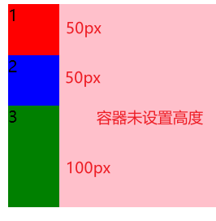

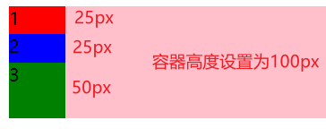

##### flex-flow

`flex-flow`是`flex-direction`和`flex-wrap`的简写

```css
flex-flow: flex-dir flex-wrap;
/*
  值的书写顺序可以互换，
  也可以省略，被省略项取默认值
  默认取值为 flex-flow: row nowrap;
*/
```

##### 项目沿侧轴排列方式一

该属性只能在项目无换行时（为单项或单个沿主轴队列时）使用

```css
align-items: flex-start|flex-end|center|stretch(default);
/* 取值不止上面几个，以上取值为常用取值 */
/*
flex-start: 项目向侧轴起点对齐
flex-end: 项目向侧轴终点对齐
center: 项目在侧轴方向上居中
stretch: 项目在侧轴方向被拉伸到与容器相同的高度或宽度，前提是不设置沿侧轴方向的高或宽才能看到效果
*/
```

##### 项目沿侧轴排列方式二

该属性只能在项目换行的情况下使用

```css
align-content: flex-start|flex-end|center|space-around|space-between|stretch(default);
/* 
flex-start: 所有沿主轴方向队列向侧轴起点对齐
flex-end: 所有沿主轴方向队列向侧轴终点对齐
center: 所有沿主轴方向队列沿侧轴居中
space-between: 在侧轴上均匀分布所有沿主轴方向队列，相邻队列距离相同，且首尾队列分别对齐侧轴起点和终点
space-around: 在主轴均匀分布所有沿主轴方向队列，相邻队列距离相同，且首尾队列分别到达侧轴起点和终点的距离为相邻队列距离的一半
stretch: 拉伸所有行来填满剩余空间。剩余空间平均地分配给每一行
*/
```

#### flex布局子项常见属性

##### 项目分配剩余空间（flex属性未完成）

`flex`设置了弹性项目如何增大或缩小以适应其弹性容器中可用的空间

用`flex`表示占**容器剩余空间**多少份数——**可以利用该属性轻松将一个父盒子分为多个等大或大小成比例的子盒子**，利用flex布局作子盒子的划分的一个优点就是**当页面宽度发生变化时，盒子也会作相应变化**

```css
flex: none|flex-grow <flex-shrink> <flex-basis>
/*可以使用一个，两个或三个值来指定 flex属性*/
/*默认取值为 flex: 0 1 auto; */
/*这里主要使用单值语法，赋予一个无单位数 number ：会被当做 flex: number 1 0; */
/*
将一个父盒子分为多个等大或大小成比例的子盒子：
	一个父盒子要分为三个等大的，只需要在三个子盒子赋予一个属性 flex: 1;
	若一个父盒子要分为三个 1:2:1 的盒子，两个设置 flex: 1; 一个设置 flex: 2;
	其他的类似，只要将属性 flex 的值做相应设置即可
*/
```

利用该属性可以实现中间盒子自动伸缩效果（流式布局也可实现该效果）

```css
/*例：*/
.container {
    display: flex;
    width: 60%;
    min-width: 320px;
    height: 100px;
    margin: 0 auto;
    background-color: pink;
}

.container div:nth-child(2n+1) {
    width: 100px;
    height: 100px;
    background-color: red;
}

.container div:nth-child(2) {
    flex: 1;
    height: 100px;
    background-color: green;
}
```

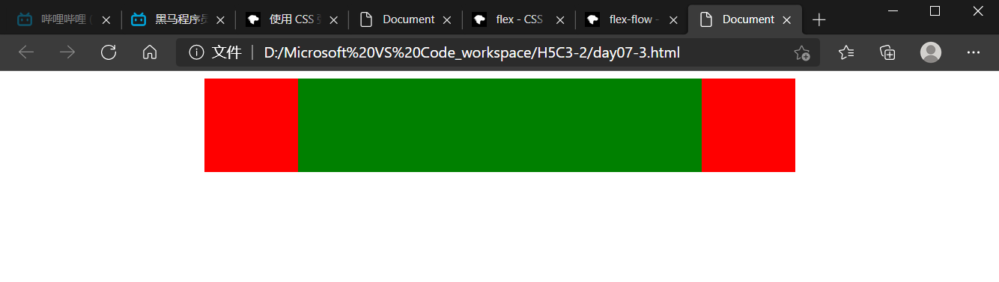

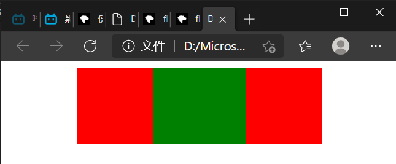

##### 项目沿侧轴对齐方式

注意`align-self`和`align-items`的区别：
`align-self`设置在项目中，`align-items`设置在容器中，前者控制单个项目的对齐方式，后者控制仅有的单个（沿主轴队列的）项目（而`align-content`也是设置在容器中且控制多个队列的项目）

```css
align-self: auto(default)|flex-start|flex-end|center|space-between|space-around|stretch
/*默认值为auto——继承其父容器的algin-items属性，若无父容器则为 stretch*/
```

##### 项目排列顺序

```css
order: integer;
/*取值为整数*/
/*
规定了弹性容器中的可伸缩项目在布局时的顺序
数值越小，排列越靠前，默认为0
*/
```

### rem适配布局

页面布局中如高度（rem）、文字大小等不能等比缩放的样式都能随着屏幕大小变化而变化（media query），而流式布局和flex布局主要针对宽度布局，不能做到让页面布局中所有的样式都发生自适应变化

#### rem基础

##### rem单位

`rem`（`root em`）是一个相对单位，类似`em`，`em`是相对于父元素字体大小，而`rem`的基准是相对于`html`元素（根元素）的字体大小

```css
/*比如：根元素设置 font-size: 12px; 
	   非根元素设置 width: 2rem; 则是指 width 为 24px	   
*/
```

##### 媒体查询（CSS3新语法）

Media Query，响应式布局的关键组成部分。在CSS中，使用`@media`at-rule根据媒体查询的结果**有条件地应用样式表的一部分**。使用它，您可以指定一个媒体查询和一个CSS块，当且仅当该媒体查询与正在使用其内容的设备匹配时，该CSS块才能应用于该文档

使用`@media`查询，可以针对不同的媒体类型和在满足相应媒体样式条件时显示已定义的不同的样式

```css
@media [mediatype[, mediatype]#] [and|not|only (media feature)]# {
    CSS-code(block);
}
/* 以上代码语法为@media at-rule的部分语法规则，具体见 https://developer.mozilla.org/zh-CN/docs/Web/CSS/@media */
 /* mediatype: all|print|screen|<ident> 
    and|not|only: not 和 only 可以省略
	(media feature): 例 —— (max-width: 540px)
例：
@media screen and (max-width: 540px) {
	body {background-color: green;}
}
@media (min-width: 320px) {
	body {background-color: blue;}
}
@media screen, print and (min-width: 320px) and (max-width: 640px) {
	body {background-color: red;}
}
*/
```

###### 引入资源

当样式繁多时，我们可以**针对不同媒体使用不同`stylesheets`（样式表）**
原理就是直接在link中判断设备的尺寸，然后**引用不同的CSS文件**

```css
<link rel="stylesheet" media="mediatype and|not|only (media feature)" href="path/to/stylesheet">
```

##### Less基础

*参考网站：<http://lesscss.cn>*

###### CSS的弊端

CSS是**一门非程序式语言**，**没有变量、函数、SCOPE（作用域）等概念**。CSS需要书写大量看似没有逻辑的代码，CSS冗余度是比较高的。不便于维护，扩展，复用。且**CSS没有很好的计算能力**。缺少CSS编写经验很难写出组织良好且易于维护的CSS代码项目

###### Less介绍

Leaner Style Sheets，是一门CSS扩展语言，也称为CSS预处理器（**一门CSS的预处理语言，扩展了CSS的动态特性**）
作为CSS的一种形式扩展，它并没有减少CSS的功能，而是在现有的CSS语法上，**为CSS加入程序式语言的特性**

Less在CSS的基础上引入了变量、Mixin（混入），运算以及函数等功能，大大简化CSS的编写，降低了CSS的维护成本

###### Less使用

在Less文件（`.less`）中书写Less语句

- Less变量

  ```less
  @param: value;
  /*param 命名不能包含特殊字符，不能以数字开头，大小写敏感*/
  ```

- Less编译
  Less文件要编译生成CSS文件才能被页面引用——需要安装一个**Less解析器**（使用VSCode插件“Easy LESS”）
  Less包含一套自定义的语法及一个解析器，用户根据这些语法定义自己的样式规则，这些规则最终会通过解析器，编译生成对应的CSS文件

- Less嵌套
  在CSS中，选择器样式的嵌套关系通常通过后代选择器实现，即

  ```css
  .parent {
      /*父元素样式*/
  }
  .parent .son {
      /*子元素样式*/
  }
  ```

  而在Less的语法中，选择器样式的嵌套关系是直接将子代选择器样式嵌套到父选择器样式块中，即

  ```less
  .parent {
      /*父元素样式*/
      .son {
          /*子元素样式*/
      }
  }
  ```

  当遇到交集、伪类或伪元素选择器时，内层选择器的前面要有`&`符号（否则它被解析为父选择器的后代）

  ```css
  .parent .son:hover {
      /*样式*/
  }
  ```

  ```less
  .parent {
      .son {
          &:hover {
              /*样式*/
          }
      }
  }
  ```

- Less运算
  任何数字、颜色或者变量都可以参与运算——Less提供了加减乘除（`+-*/`）算术运算。运算可以发生在变量中或是样式中
  多个数参与运算如果只有一个数有单位，则最后的结果就以这个单位为准；如果多个数参与运算多个数的单位不一致，以第一个数的单位为准（**对于颜色值的运算比较特殊**）

  ```less
  // 颜色值的取值有三种：十六进制颜色值，关键字，颜色函数（如rgb(), rgba()）
  // 无论另外一个运算对象的单位是什么，颜色值的取值是哪种，最终运算结果只保留十六进制颜色值
  @color: 2 * #000011; 
  // 和
  @color: 2px * #000011;
  // 等同 —— #000022。但当颜色值计算结果超出一个原色值域，将以 ff 满取值代替，如
  @color: 2 * #000008;
  // 计算结果为 #000010 ，而
  @color: 2 * #000080; 
  // 计算结果为 #0000ff。其余的取关键字或含数字值的如
  @color: 2 * blue; // #0000ff
  @color: 2 * pink; // #ffffff
  @color: 2 * rgb(255, 0, 0); // #ff0000
  @color: 2 * rgba(11, 0, 0, .5); // #160000，自动忽视了最后的alpha取值
  // 等等，计算结果均为十六进制数值
  ```

  注意在最新的Less语法中不能直接使用除号`/`进行运算**必须加上括号**

  ```less
  font-size: (80rem / @font-size)
  ```

- Less导入
  这里的导入是指在一个`.less`文件中导入另一个`.less`文件——`@import`

  ```less
  @import "common.less";
  // 或
  @import "common";
  ```

##### rem适配方案

让一些不能等比自适应的元素达到当设备尺寸发生变化的时候，适配当前设备
具体做法：使用媒体查询根据不同设备按比例设置`html`元素的字体大小，然后页面使用`rem`做尺寸单位，当`html`元素的字体大小变化是元素尺寸也会发生变化，从而达到等比例缩放的适配

###### 技术方案1

- Less
- media query
- rem

一个设计稿的预设宽度为`n px`，将其分为`m`等份，每一份作为`html`元素的`font-size`，则页面元素的尺寸以`rem`为单位，为`页面尺寸/(n/m) rem`

```less
// 例：设计稿是 750px ，划分 15 等份，每份 50px ，则
@root-font-size: (750px / 15);
html {
    font-size: @root-font-size;
}
.a-box {
    width: (100rem / @root-font-size); 
    height: (100rem / @root-font-size);
}
// 此时当 html 的字体大小通过 media query 随页面变化时，a-box的高宽始终为 1:1
```

在实际开发中会在预设宽度的基础上，再添加几个不同屏幕下的媒体查询选项来**动态地改变`html`的`font-size`**，以达到在大多数设备上能实现 rem响应式布局 的效果，以下为一个`common.less`的内容（**注意：当使用了rem适配方案`flexible.js`时，不需要再编写这些内容**）

```less
// 设置常见的屏幕尺寸，利用媒体查询修改html元素的字体大小

// 根据CSS代码的层叠性，这个一定要写在最上面 
// 由于PC端也能打开移动端页面，这个样式是为PC端页面设置的
//（但是在PC端下屏幕宽度大于750px，最后一个项关于屏幕宽度的媒体查询已经可以将html的font-size设置为50px，这一样式设置怎么看都多余）
html {
    font-size: 50px;
}

// 屏幕宽度划分份数
@num: 15;

@media screen and (min-width: 320px) {
    html {
        font-size: (320px / @num);
    }
}

@media screen and (min-width: 360px) {
    html {
        font-size: (360px / @num);
    }
}

@media screen and (min-width: 375px) {
    html {
        font-size: (375px / @num);
    }
}

@media screen and (min-width: 384px) {
    html {
        font-size: (384px / @num);
    }
}

@media screen and (min-width: 400px) {
    html {
        font-size: (400px / @num);
    }
}

@media screen and (min-width: 414px) {
    html {
        font-size: (414px / @num);
    }
}

@media screen and (min-width: 424px) {
    html {
        font-size: (424px / @num);
    }
}

@media screen and (min-width: 480px) {
    html {
        font-size: (480px / @num);
    }
}

@media screen and (min-width: 540px) {
    html {
        font-size: (540px / @num);
    }
}

@media screen and (min-width: 720px) {
    html {
        font-size: (720px / @num);
    }
}

@media screen and (min-width: 750px) {
    html {
        font-size: (750px / @num);
    }
}
```

*在进行开发时，CSS的样式在`.less`文件中编写，再编译为`.css`文件。样式中的几乎所有尺寸单位都为`rem`，绝不可随便使用其他单位*

###### 技术方案2（推荐）

- flexible.js
- rem

*GitHub仓库地址：<https://github.com/amfe/lib-flexible>*

在技术方案1中，需要在实际开发时编写多个常见屏幕尺寸的媒体查询项，以此来动态地改变根元素的字体大小（`common.less`的内容），而在技术方案2中，`flexible.js`可以帮助开发者在开发时省去这些代码的编写——里面的js代码做了相关处理：**把当前设备分为10等份**，但在不同设备下比例还是一致的，所需要的做的只是确定好当前设备的`html`文字大小

```less
/*
如当设计稿为 750px 时，只需要把 html 文字大小设置为 75px（750px / 10）即可
其他样式的尺寸则只需以 1rem = 75px 来换算成 以rem为单位的尺寸大小
*/
```

技术方案2中并未使用Less，为了将设计稿中尺寸单位快速的转换为`rem`，使用VSCode中的”cssrem“插件（使用其他代码编辑器也可找到对应插件）

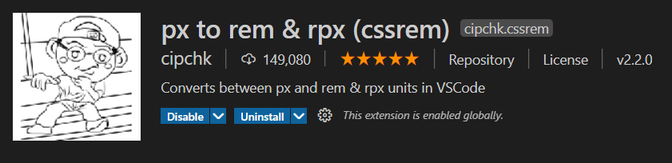

注意：该插件默认的根元素字体大小为`16px`，所以转换时是以`1rem = 16px`来转换的，所以在实际开发中，如果设计稿中的根元素字体大小不为`16px`则需要特别进行设置！！！（在插件设置中设置）
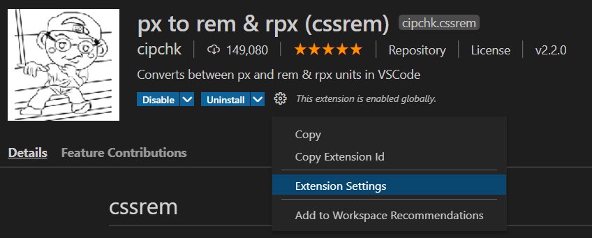


###### 两种方案总结

`less + rem + media query`和`flexible.js + rem`两种方案的最大差别在于

- 对在不同屏幕尺寸下的`html`元素的字体大小的改变方式：
  `less + rem + media query`方案通过编写不同屏幕尺寸条件下的媒体查询项（CSS（Less）代码）来改变
  `flexible.js + rem`方案通过编写JS代码来实现，只需要关注JS代码把**屏幕宽度分为10等份**，1等份大小为`html`字体大小
- 对样式中尺寸单位换算为`rem`的方式：
  `less + rem + media query`方案通过`less`的运算能力来进行换算
  `flexible.js + rem`方案通过自行换算或插件自动换算（换算时，`1rem = 设计稿宽度 / 10 px`）
- 相比`less + rem + media query`方案，`flexible.js + rem`方案可以覆盖的屏幕尺寸的取值是连续的，而前者是离散的（即只会根据写定的几个屏幕宽度的媒体查询项对应的屏幕宽度进行有限的适配调节），这也使得`flexible.js + rem`方案的适配布局效果比`less + rem + media query`方案要“流畅”

注意两种方案中对于`body`样式设置的主要差别：

- `less + rem + media query`方案：

  ```less
  body {
      // 其中 <n> 为划分份数
      width: <n>rem;
      min-width: 320px;
      /* 其他样式设置 */
  }
  ```

- `flexible.js + rem`方案：

  ```css
  body {
      /* 这里份数一定为10 */
      width: 10rem;
      min-width: 320px;
      /* 其他样式设置 */
  }
  /* 或者 */
  body {
      /* less + rem + media query方案尽量不使用这种设置，因为设置的屏幕宽度的媒体查询项在 320~750px 间是离散而非连续的，
         在某些屏幕宽度下可能会由于CSS样式设置的原因导致部分页面元素和另一部分页面元素尺寸不一致（不协调） */
      /* 此时body的宽度会在 320~750px 范围内随屏幕宽度变化 */
      max-width: <设计稿宽度>px;
      min-width: 320px;
      /* 其他样式设置 */
  }
  ```

由于设计稿的宽度可能会小于屏幕宽度（如750px），以上两种方案有各自的设定方式：

- `less + rem + media query`方案：

  ```less
  // 在各种屏幕尺寸的媒体查询项前设置设计稿应有的html字体大小
  html {
      font-size: <设计稿宽度 / 份数>px;
  }
  ```

- `flexible.js + rem`方案：

  ```css
  /* 当屏幕尺寸大于设计稿宽度时，会出现适配布局结果混乱的情况，所以应该将适配布局时随屏幕尺寸改变的html字体大小限制 */
  @media screen and (min-width: 750px) {
      html {
          /* 注意份数一定为 10 ，这是 js 代码中的设置 */
          /* 加上 !important 是为防止该样式设置会因权重不够高而被覆盖 */
          font-size: <设计稿宽度 / 10>px !important;
      }
  }
  ```

*最后一句：以上的`html`字体大小取值往往是按当前视觉视口宽度除以份数的值取的。但实际上，只要当前的`html`字体大小和`rem`之间的换算关系正确，都可以实现rem适配布局的效果。这只是一个比例关系问题，只要单位的换算是正确的就可以*

```css 
/* 例如： */
/* 此时采用的是 flexible.js + rem */
body {
    min-width: 320px;
    max-width: 750px;
    margin 0 auto;
    background-color: #f6f6f6;
}

/* 当屏幕宽度大于 750px 时，将 html 字体大小设置为 37.5px， 而不是 设计稿宽度750px 除以 份数10 得到的 75px */
@media screen and (min-width: 750px) {
    html {
        font-size: 37.5px !important;
    }
}
/* 这样的设置并不会有什么问题，还是可以实现rem适配布局的效果，只是当屏幕宽度 >=750px 时，页面元素的尺寸恰好和屏幕宽度为375px时的页面元素的尺寸一致 */
/* 个人见解：不应该这样设置，按照 屏幕（最大）宽度 / 份数 的做法来等比例动态变化 html字体大小 ，我认为更合理 */
```

### 响应式布局

使用媒体查询针对不同宽度的设备进行布局和样式设置，从而达到适配不同设备的目的

响应式布局需要**一个父级容器作为布局容器**来配合子级元素实现变化效果（**排列方式**、**样式变化**）
原理是在不同屏幕下通过媒体查询来改变布局容器的大小，再改变里面的子元素排列方式和大小，从而实现不同屏幕下看到的不同页面布局和样式变化

注意：响应式布局和其他三种布局的最大区别在于，其他三种布局无论屏幕如何变化，都只是改变页面元素的样式（主要是元素尺寸），而不会改变**页面元素的排列方式**，响应式布局则会根据屏幕尺寸的不同采用不同的元素排列方式和元素样式

按照设备划分，往往将父级容器的宽度按如下规律设置：

|            设备划分（尺寸区间）             | 宽度设置 |
| :-----------------------------------------: | :------: |
|          超小屏幕（手机，< 768px）          |   100%   |
|    小屏设备（平板，>= 768px ~ < 992px）     |  750px   |
| 中等屏幕（桌面显示器，>= 992px ~ < 1200px） |  970px   |
|      大屏幕（大桌面显示器，>= 1200px）      |  1170px  |

#### Bootstrap（前端开发框架）

Bootstrap 来自 Twitter ，是基于HTML、CSS和JavaScript的前端开发框架，它简洁灵活，使得web开发更加快捷
优点：标准化的HTML+CSS编码规范；提供了一套简洁、直观、强悍的组件；有自己的生态圈，不断地更新迭代；让开发更简单，提高了开发效率

以下为Bootstrap框架中一些常用的组件或样式

##### 布局容器

Bootstrap需要为**页面内容**和**栅格系统**包裹一个`.container`容器。该框架提供了两个作此用处的类：

-  `.container`类：用于**固定宽度**并**支持响应式布局**的容器（宽度的设置和上述关于响应式布局按设备划分设置出父级容器的宽度规律一致）
- `.container-fluid`类：用于100%宽度，占据全部视口（viewport）的容器（流式布局？？？）

布局容器的宽度变化规律和上述响应式布局的父级容器按设备划分尺寸的规律一致，这里注意：可以根据需要（设计稿宽度），修改布局容器在某些屏幕尺寸下的宽度

 ```css
/* 假设此时设计稿为 1280px ，而布局容器按设备划分的宽度并没有 1280px 这个尺寸
   所以此时需要特别的进行设置 */
@media screen and (min-width: 1280px) {
    .container {
        width: 1280px;
    }
}
 ```

注意：布局容器默认会有左右内边距（15px），所以这两种容器类不能互相嵌套，否则宽度可能会因为内边距的存在而比预期要小或与预期不同

##### 栅格系统

grids system，这是Bootstrap提供的一套**响应式**、**移动设备优先**的流式栅格系统，随着屏幕或视口尺寸的增加，系统会自动分为**最多12列**

栅格系统用于**通过一系列的行（row）与列（column）的组合**来创建页面布局

###### 行与列

- **“行”必须包含在布局容器中**，以便为其赋予合适的排列（aligment）和内补（padding）
- 通过“行”在水平方向创建一组“列”，**内容应当放置在“列”内**，**只有“列”可以作为“行”的直接子元素**
- 一般来说，**“列”应该要放到“行”中**，而不是直接放在布局容器或另一个列中，这是因为列或容器默认有左右内边距15px，没有“行”会使得其中的“列”左右留空，并且“列”的高度不会等于其父元素的高度
- 通过**预定义类“.row”创建“行**，通过**前缀为“.col-\*-\*”的预定义类（[详见下表](#栅格参数)）来根据不同屏幕宽度创建“列”**
- 列与列之间的间隔称为“gutter”，通过为“列”设置`padding`创建间隔（左右15px）；通过为“行”元素设置负值的`margin`（左右-15px）从而抵消掉为布局容器设置的`padding`（间接为“行”所包含的“列”抵消掉了布局容器的`padding`）*（这些内外间距都是默认的）*
- **一个“行”的“列”最多为12个**，当在同一行中通过栅格参数设置的列数总和少于12时，该行会留有多余空间；当多于12时，多余的列所在元素将被**作为一个整体**另起一行排列（“作为一个整体”导致有时侯另起一行后原来的那行会留有多余空间）

###### 栅格参数

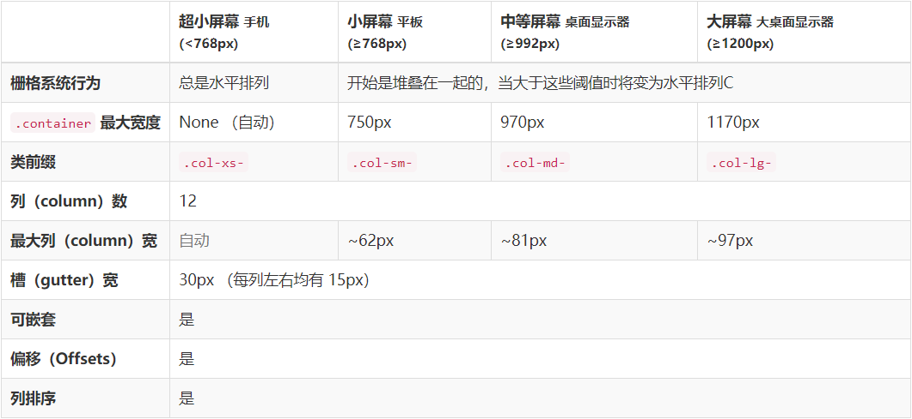

```css
/* 这里的栅格参数的前缀的最后是要添加一个正整数（1~12），如 */
.col-lg-3
/* 
	xs  extra small
	sm  small
	md  medium
	lg	large
*/
```

不同的列参数类针对不同的屏幕尺寸设备，所以**当栅格参数对应的屏幕尺寸未超过*对应阈值*，表现为堆叠，否则水平排列（多余的列所在元素会作为一个整体另起一行）**。故往往对**一个列元素使用多个栅格参数**

```css
/* 
	例：当屏幕为较小时一行一列（即表现堆叠排列，所以将col-xs-12去掉效果一致），
		当屏幕为小屏幕时，一行两列；当屏幕为中等屏幕时，一行三列；
		大屏幕时一行三列，列的宽度变大
*/
<div class="container">
	<div class="row">
		<div class="col-xs-12 col-sm-6 col-md-4">AAA</div>
		<div class="col-xs-12 col-sm-6 col-md-4">AAA</div>
		<div class="col-xs-12 col-sm-6 col-md-4">AAA</div>
	</div>
</div>
```

###### 列嵌套

就是在“列”中嵌套一个“行”，再在“行”中设置“列”（设置方式同上）。*并且要注意：如果直接在“列”中嵌套列，会无法取消父元素中的左右内边距，并且高度不会等于父级高度*

###### 列偏移

实际上就是给“列”元素添加**左外边距**（自动计算）（取值为0~12）

|                  |                  |                  |                  |
| :--------------: | :--------------: | :--------------: | :--------------: |
| .col-xs-offset-* | .col-sm-offset-* | .col-md-offset-* | .col-lg-offset-* |

要超过***对应的阈值***才会生效

*注：可以使用`.col-*-offset-0`来覆盖设置好的偏移量*

###### 列排序

通过`.col-*-push-*`和`.col-*-pull-*`改变列的顺序（取值为0~12）

`.col-*-push-*`为“往后推”，即将顺序推后，实际上就是设置“列”元素的**左边移量**；
`.col-*-pull-*`为“往前拉”，即将顺序提前，实际上就是设置“列”元素的**右边移量**

“列”元素为浮动元素（左浮动），所以写在前面的盒子会在排序过程中若重叠，会被写在后面的盒子“压住”

|                |                |                |                |
| :------------: | :------------: | :------------: | :------------: |
| .col-xs-push-* | .col-sm-push-* | .col-md-push-* | .col-lg-push-* |
| .col-xs-pull-* | .col-sm-pull-* | .col-md-pull-* | .col-lg-pull-* |

要超过***对应的阈值***才会生效

*注：可以使用`.col-*-*-0`来覆盖设置好的排序*

##### 响应式工具

使用工具类，针对不同设备（屏幕尺寸）展示或隐藏页面内容

注意：以下的工具类要在对应的屏幕尺寸***取值区间内***才会生效，而不是超过了一个阈值就生效，若超出取值区间上限，会失效

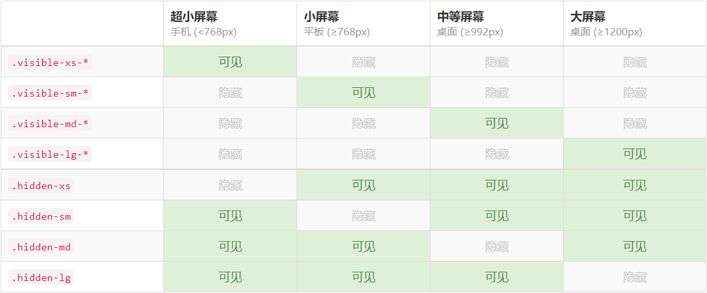

从 v3.2.0 版本起，形如 `.visible-*-*` 的类针对每种屏幕大小都有了三种变体，每个针对 CSS 中不同的 `display` 属性，列表如下：

|           类组            |      CSS`display`       |
| :-----------------------: | :---------------------: |
|    `.visible-*-block`     |    `display: block`     |
|    `.visible-*-inline`    |    `display: inline`    |
| `.visible-*-inline-block` | `display: inline-block` |

`.visible-xs`、`.visible-sm`、`.visible-md` 和 `.visible-lg` 类也同时存在。但是**从 v3.2.0 版本开始不再建议使用**。除了 `<table>` 相关的元素的特殊情况外，它们与 `.visible-*-block` 大体相同

##### 附：

- bootstrap框架已经有清除浮动相关工具类`.clearfix`，直接调用即可
- 注意bootstrap框架中有很多见名知义的预定义类，要当心由于重名并且在不了解预定义类的样式的情况下，使页面渲染结果出现无法理解的地方（如`.nav`，我刚开始不知道预定义的导航组件基类为`.nav`，并且也不知道这个类已经进行了清除浮动的相关样式设置，导致我疑惑了很久为什么在我没有添加`.clearfix`进行清除浮动的情况下，清除浮动就已经生效了。知道一点点的对比才发现是自以为自定义的`.nav`和预定义类重名了）

### 移动端布局技术选型策略

移动端布局主要有以上四种：

- 流式布局（百分比布局）
- flex布局（推荐）
- rem适配布局（推荐）
- 响应式布局

选择的策略是：选取一种作为主要选型，其他在必要时作为辅助（如页面布局的某些局部有时候采用其中一种布局的技术比较好），进行混合技术开发

## 移动端技术解决方案

### CSS初始化

移动端初始化推荐使用[`normalize.css`](http://necolas.github.io/normalize.css/)（[GitHub仓库](https://github.com/necolas/normalize.css/)）

*注意：如果使用了Bootstrap框架，则无需引入该CSS初始化文件，因为[该框架为了增强跨浏览器表现的一致性，已经使用了该文件](https://v3.bootcss.com/css/#overview-normalize)*

### 移动端特殊样式设置

```css
/*CSS3盒子模型*/
box-sizing: border-box;
-webkit-box-sizing: border-box;
/*点击高亮我们需要清除——设置为 transparent */
* {
    -webkit-tap-highlight-color: transparent;
}
/*移动端浏览器样式在iOS上加上以下该属性才能给按钮和输入框自定义样式*/
input {
    -webkit-appearance: none;
}
/*禁用长按页面时的弹出菜单*/
img, a {
    -webkit-touch-callout: none; 
}
```

### Swiper（未完成）

*相关链接：<https://www.swiper.com.cn/>*

swiper轮播图的使用涉及`JavaScript`，当前还没有学习相关内容，固先为“模板套用”的方式使用


## 附

### 网页图片技术


### 框架

是一套架构，它有一套比较完整地网页功能解决方案，而且控制权在框架本身（即需要按照框架所规定的某种规范进行开发），有预制样式库、组件和插件